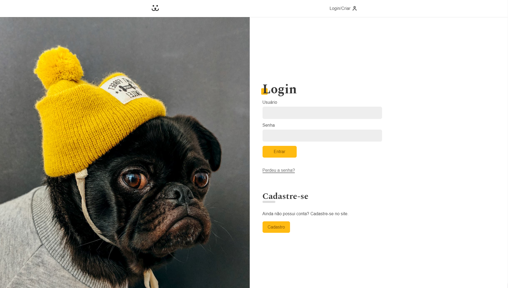

<h1 align="center">
    Dogs
</h1>



## 💻 Projeto

Este é o projeto final do curso de React.js da [Origamid](https://www.origamid.com/curso/react-completo/). O projeto consiste em uma rede social voltada aos pets. Muito semelhante ao Instagram, é possível criar um usuário, postar fotos e fazer comentários. A base do projeto foi toda feita em React, sem nenhum biblioteca ou lib externa, apenas na parte de estatísticas foi utilizado o [Victory](https://github.com/FormidableLabs/victory), que consiste na introdução de componentes interativos fazendo com que nossas estatísticas sejam vistas em gráficos estruturados. Diferente do projeto original que utiliza CSS Modules, tive a iniciativa de desenvolvedor o projeto utilizando CSS-in-JS, mais especificamente, com Styled-components. Também foi utilizado a biblioteca [react-router-dom](https://github.com/remix-run/react-router), dando assim, vida a nossa aplicação, permitindo que o usuário navegue pelas rotas. Neste projeto, consumimos uma Wordpress RestAPI, desenvolvida em um [curso anterior](https://www.origamid.com/curso/wordpress-rest-api-dogs).

## ✨ Tecnologias

Esse projeto foi desenvolvido com as seguintes tecnologias:

- [React](https://reactjs.org)
- [React-router-dom](https://github.com/remix-run/react-router)
- [Styled-components](https://styled-components.com/)
- [Victory](https://github.com/FormidableLabs/victory)

## 🚀 Como executar

Clone o projeto e acesse a pasta do mesmo.

```bash
$ git clone https://github.com/d0ugui/insta-dogs.git
$ cd insta-dogs
```

Para iniciá-lo, siga os passos abaixo:

```bash
# Instalar as dependências
$ yarn

# Iniciar o projeto
$ yarn start
```

"Documentação" da API

```base
https://dogsapi.origamid.dev/json
```

O app estará disponível no seu browser pelo endereço http://localhost:3000/

## 📝 License

Esse projeto está sob a licença MIT.
